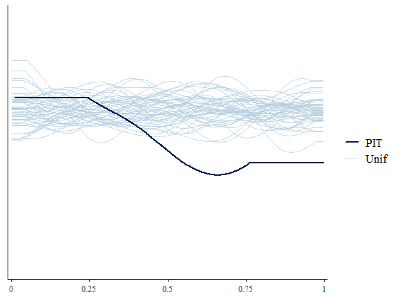
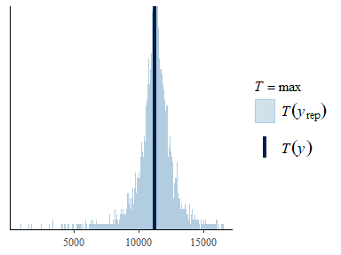
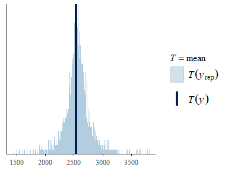
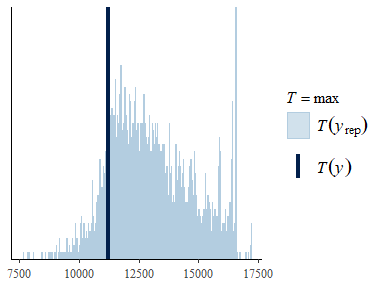

Bayesian analysis of ([Dorazio and Hunter
2015](#ref-Dorazio_Hunter_2015)) dilution data and model
================
Roy Martin, ORD
08-19-2019

# 1 Background

This is an RMarkdown documentation of a fully Bayesian implementation of
the ([Dorazio and Hunter 2015](#ref-Dorazio_Hunter_2015)) binomial model
for analyzing dPCR experiments. Below, we implement the original model
in

([Carpenter et al. 2015](#ref-Carpenter_etal_2015)) and compare the
results with the maximum likelihood estimates provided by ([Dorazio and
Hunter 2015](#ref-Dorazio_Hunter_2015)). In subsequent comparisons, we
implement partial pooling via hierarchical intercepts and/or slopes. We
make comparisons using Bayesian leave-one-out cross validation
(‘LOO-CV’) via the

package in
,
which implements fast and stable computations for approximate LOO-CV
([Vehtari, Gelman, and Gabry 2017](#ref-Vehtari_etal_2017)). The
computations are based on the log-likelihood evaluated at the posterior
simulations of the parameter values for a fitted model, and result in
point wise estimates of out-of-sample prediction accuracy.

# 2 Setup R

Set the workding directory and load relevant packages:

``` r
#set directories and R package library

library(ggplot2)
library(ggExtra)
library(gridExtra)
library(stringr)
library(readxl)
library(tidyverse)
library(rstan)
library(loo)
library(bayesplot)
library(tidybayes)

rstan_options(auto_write = TRUE)
options(mc.cores = parallel::detectCores())
knitr::opts_chunk$set(warning = FALSE, message = FALSE)
```

# 3 Import data

To begin, we import the dilution dataset from the ([Dorazio and Hunter
2015](#ref-Dorazio_Hunter_2015)) article supplement.

``` r
#importa data to object
dil_dat <- read.table(file="dilutionData.csv", header=T, fill=TRUE, sep=",")

print(dil_dat)
```

    ##           conc npositive ntotal
    ## 1  1572.593658      8830  13192
    ## 2  1572.593658      9323  13590
    ## 3  1572.593658     11223  16549
    ## 4  1572.593658     10756  15877
    ## 5  1572.593658      8385  12527
    ## 6  1572.593658      9321  13843
    ## 7  1572.593658     11128  16399
    ## 8  1572.593658      9779  14371
    ## 9  1572.593658     10014  14838
    ## 10 1572.593658      9102  13671
    ## 11  393.148414      3378  13059
    ## 12  393.148414      3734  14416
    ## 13  393.148414      4108  16062
    ## 14  393.148414      4042  15581
    ## 15  393.148414      4002  15211
    ## 16  393.148414      3559  14074
    ## 17  393.148414      4222  16077
    ## 18  393.148414      3018  12044
    ## 19  393.148414      4406  17191
    ## 20  393.148414      3811  15578
    ## 21   98.287104      1031  14813
    ## 22   98.287104      1075  14278
    ## 23   98.287104      1130  15040
    ## 24   98.287104      1199  16117
    ## 25   98.287104      1245  16703
    ## 26   98.287104      1029  14694
    ## 27   98.287104      1318  17472
    ## 28   98.287104      1161  16981
    ## 29   98.287104      1221  16540
    ## 30   98.287104       854  13003
    ## 31   24.571776       318  13725
    ## 32   24.571776       340  15617
    ## 33   24.571776       402  15923
    ## 34   24.571776       354  14608
    ## 35   24.571776       410  16738
    ## 36   24.571776       348  14701
    ## 37   24.571776       239  13464
    ## 38   24.571776       483  19313
    ## 39   24.571776       440  17776
    ## 40   24.571776       401  17833
    ## 41    6.142944        72  15594
    ## 42    6.142944        84  16468
    ## 43    6.142944        83  16028
    ## 44    6.142944        76  15386
    ## 45    6.142944        92  17742
    ## 46    6.142944        37  12710
    ## 47    6.142944        78  17005
    ## 48    6.142944        96  18030
    ## 49    6.142944        86  16990
    ## 50    6.142944        91  18137
    ## 51    1.535736        21  14393
    ## 52    1.535736        18  16223
    ## 53    1.535736        20  15668
    ## 54    1.535736        21  13788
    ## 55    1.535736        14  11759
    ## 56    1.535736        30  16457
    ## 57    1.535736        23  16253
    ## 58    1.535736        17  14533
    ## 59    1.535736        25  16136
    ## 60    1.535736        22  18474

# 4 Original analysis by ([Dorazio and Hunter 2015](#ref-Dorazio_Hunter_2015))

Here, we estimate the parameters via maximum likelihood using
}")
in
,
as performed in the article supplement:

``` r
d <- read.csv(file = 'dilutionData.csv')
y <- d[, 'npositive']
m <- d[, 'ntotal']
x <- d[,'conc']

v <- 0.91 / 1000  # constant volume (microliters) per droplet (physical constant)


# fit model using glm()
v.offset <- rep(log(v), length(y))
ymat <- cbind(y, m-y)
fit <- glm(ymat ~ log(x), family = binomial(link = 'cloglog'), offset = v.offset)
beta.mle <- fit$coefficients
beta.vcv <- vcov(fit)
beta.se <- sqrt(diag(beta.vcv))
alpha <- 0.05  # significance level for confidence intervals
zcrit <- qnorm(1 - alpha / 2)
beta.lowerCL <- beta.mle - zcrit * beta.se
beta.upperCL <- beta.mle + zcrit * beta.se
deviance <- fit$deviance
GOF <- 1 - pchisq(deviance, df = length(y) - length(beta.mle))

# Estimate concentration of each dilution
X <- model.matrix(~ log(x))
X.pred <- unique(X)
lambda.est <- rep(NA, dim(X.pred)[1])
lambda.lowerCL <- rep(NA, dim(X.pred)[1])
lambda.upperCL <- rep(NA, dim(X.pred)[1])

for(i in 1:dim(X.pred)[1]) {
    Xvec <- matrix(X.pred[i, ], ncol = 1)
    loglambda.est <- t(Xvec) %*% beta.mle
    loglambda.var <- t(Xvec) %*% beta.vcv %*% Xvec
    lambda.est[i] <- exp(loglambda.est)
    lambda.lowerCL[i] <- exp(loglambda.est - zcrit * sqrt(loglambda.var))
    lambda.upperCL[i] <- exp(loglambda.est + zcrit * sqrt(loglambda.var))
    }

# Summarize results
beta.out <- cbind(beta.mle, beta.se, beta.lowerCL, beta.upperCL)
dimnames(beta.out)[2] <- list(c('MLE', 'SE', '2.5%', '97.5%'))

print(beta.out)
```

    ##                    MLE          SE       2.5%      97.5%
    ## (Intercept) 0.04572709 0.015839042 0.01468314 0.07677105
    ## log(x)      0.96095279 0.002358689 0.95632985 0.96557574

``` r
lambda.out <- data.frame(cbind(standard = unique(x), lambda.est, lambda.lowerCL, lambda.upperCL))

print(lambda.out)
```

    ##      standard  lambda.est lambda.lowerCL lambda.upperCL
    ## 1 1572.593658 1234.970556    1227.310318    1242.678604
    ## 2  393.148414  325.915768     323.967895     327.875351
    ## 3   98.287104   86.011028      85.092405      86.939569
    ## 4   24.571776   22.698801      22.324272      23.079612
    ## 5    6.142944    5.990343       5.855228       6.128575
    ## 6    1.535736    1.580886       1.535559       1.627550

# 5 Fit a Bayesian version (complete pooling)

Next, we’ll construct a Bayesian version of the original model in the

language. The model parameters are fit to the data via Hamiltonian Monte
Carlo (HMC) as implemented in

and via the

interface.

First, we write out a Bayesian interpretation of the model in the

syntax. We also include an option to sample from the prior only, for
prior predictive checking. We use wide uniform priors on the parameters
which should provide a closer analogy to the MLE estimates above.

``` stan
data{
 int< lower=1 > N;  // number of observations
 int< lower=1 > U; //number unique standard concentrations
 int< lower=0 > y[N];  // n success
 int< lower=1 > trials[N];  // n trials
 vector[N] x1;  // covariate vector
 vector[U] x1_u; // for estimates at the U unique standard concns
 int<lower=0, upper=1> prior_only; // should the likelihood be ignored?
 
 vector< lower=0 >[N] vol_c; // volume of chamber (mL) for conc. in gen. quant.k
 }
parameters{
 real a0; // population intercept
 real b1; // pop-level slope
 }
model{
 // initialize linear predictor term
 vector[N] mu = a0 + x1 * b1 + log(vol_c);
 
 // apply the inverse link function
 mu = inv_cloglog(mu);
 
 //Priors
 target += uniform_lpdf(a0 | -10, 10); //normal_lpdf( a0 | 0, 4 );
 target += uniform_lpdf(b1 | -10, 10); //normal_lpdf( b1 | 0, 4 );
 
 //Likelihood
 if(prior_only == 0) //update with data when prior_only == 0
  target += binomial_lpmf(y | trials, mu);
 }
generated quantities{
 real y_new[N];
 real log_lik[N];
 real lambda_mean_est[U];
 vector[N] mu = a0 + x1 * b1 + log(vol_c);

 for(i in 1:N) {
  // compute marginal posterior predictive distribution for y
  y_new[i] = binomial_rng(trials[i] , inv_cloglog(mu[i]));
  // compute pointwise log-likelihoood
  log_lik[i] = binomial_lpmf(y[i] | trials[i] , inv_cloglog(mu[i]));
  }
 
 for(u in 1:U)
  // compute lambda for each unique concentration standard
  lambda_mean_est[u] = exp(a0 + b1 * x1_u[u]);
 }
```

## 5.1 Prior predictive simulation

Here, we want to check that our priors for the intercept,
,
and slope,
,
are sensible. We chose
")
and
")
First, we create a data list for Stan and code the parameter
‘prior_only’ = 1.

``` r
stan_dataList_1_prior <- list(N = length(dil_dat$npositive),
                               U =length(unique(dil_dat$conc)),
                               y = dil_dat$npositive,
                               trials = dil_dat$ntotal,
                               x1 = log(dil_dat$conc),
                               x1_u = log(unique(dil_dat$conc)), 
                               vol_c = rep((0.91 / 1000), nrow(dil_dat)),
                               prior_only = 1 # sample from prior only? 
                               )
```

We run the model without updating with the observed data to investigate
our priors.

``` r
fit_1_prior <- sampling(object = Bin_dilution,
                        data = stan_dataList_1_prior,
                        chains = 4,
                        iter = 2000,
                        cores = 4,
                        seed = 1234
                        )
```

We can ignore the warnings in this particular case. These are a result
of trying to calculate the pointwise log-likelihood in the generated
quantities block.

Lets look at a pairs plot to assess HMC sampling.

``` r
pairs(fit_1_prior, pars=c("a0", "b1", "lp__"))
```


### 5.1.1 Print parameter summaries

Now lets print the parameter summaries, which should just give us back
summaries of our priors.

``` r
print(fit_1_prior, pars=c("a0", "b1", "lp__"), digits=4)
```

    ## Inference for Stan model: anon_model.
    ## 4 chains, each with iter=2000; warmup=1000; thin=1; 
    ## post-warmup draws per chain=1000, total post-warmup draws=4000.
    ## 
    ##         mean se_mean     sd    2.5%     25%     50%     75%   97.5% n_eff
    ## a0   -0.0215  0.3338 5.9391 -9.5909 -5.2332 -0.0721  5.2774  9.5966   317
    ## b1   -0.2907  0.3335 5.7567 -9.6069 -5.3312 -0.4511  4.5977  9.4549   298
    ## lp__ -5.9915  0.0000 0.0000 -5.9915 -5.9915 -5.9915 -5.9915 -5.9915     2
    ##        Rhat
    ## a0   1.0041
    ## b1   1.0174
    ## lp__ 0.9990
    ## 
    ## Samples were drawn using NUTS(diag_e) at Tue Mar  4 13:52:01 2025.
    ## For each parameter, n_eff is a crude measure of effective sample size,
    ## and Rhat is the potential scale reduction factor on split chains (at 
    ## convergence, Rhat=1).

### 5.1.2 Prior predictive Checks

Here we can look at what our priors imply for the prior predictive
distribution. We’ll look at the distribution of the mean, min, and max
for replicated datasets. \#### Replicated min, mean, max, sd


#### 5.1.2.1 Marginal predictions along concentration gradient

We can also summarize ‘npositive’ replicated from prior model along the
concentration gradient. We have the observed ‘npositive’ here as well,
but only because it is included as part of a convenient

function. Specifically, we’re looking at the log-scale ‘npositive’
vs. ,
or the prior preditive distribution of log( ‘npositive’ ).


## 5.2 Fitting the original model to observed data

Now lets fit the model to the actual data.

The data list for Stan (with “prior_only” now set to
).

``` r
stan_dataList <- list(N = length( dil_dat$npositive),
                      U = length( unique(dil_dat$conc)),
                      y = dil_dat$npositive,
                      trials = dil_dat$ntotal,
                      x1 = log(dil_dat$conc),
                      x1_u = log(unique(dil_dat$conc)), 
                      vol_c = rep((0.91 / 1000), nrow(dil_dat)),
                      prior_only = 0
                      )
```

We fit the model:

``` r
fit_1 <- sampling(object = Bin_dilution,
                  data= stan_dataList,
                  chains = 4,
                  iter = 2000,
                  cores = 4,
                  thin = 1,
                  seed = 246
                  )
```

Lets look at the pairs plot.

``` r
pairs(fit_1, pars=c("a0", "b1", "lp__"))
```


Note the strong correlation between samples of

and
.
Thought this could frustrate HMC sampling, it does make practical sense
in the context of the calibration curve.

### 5.2.1 Print and compare parameter summaries

Now lets print our Bayesian parameter estimates and compare them to the
original ML estimates.

First the Bayesian model estimates for the intercept and slope
parameters:

``` r
print(fit_1, pars=c("a0", "b1", "lp__"), digits = 3)
```

    ## Inference for Stan model: anon_model.
    ## 4 chains, each with iter=2000; warmup=1000; thin=1; 
    ## post-warmup draws per chain=1000, total post-warmup draws=4000.
    ## 
    ##          mean se_mean    sd     2.5%      25%      50%      75%    97.5% n_eff
    ## a0      0.045   0.001 0.016    0.015    0.034    0.045    0.056    0.078   515
    ## b1      0.961   0.000 0.002    0.956    0.959    0.961    0.963    0.966   510
    ## lp__ -350.535   0.035 1.014 -353.138 -350.927 -350.242 -349.815 -349.540   862
    ##       Rhat
    ## a0   1.003
    ## b1   1.003
    ## lp__ 1.000
    ## 
    ## Samples were drawn using NUTS(diag_e) at Tue Mar  4 13:52:54 2025.
    ## For each parameter, n_eff is a crude measure of effective sample size,
    ## and Rhat is the potential scale reduction factor on split chains (at 
    ## convergence, Rhat=1).

Then the ML estimates:

``` r
print(beta.out, digits = 2) #compare to MLE
```

    ##               MLE     SE  2.5% 97.5%
    ## (Intercept) 0.046 0.0158 0.015 0.077
    ## log(x)      0.961 0.0024 0.956 0.966

To three digits, the Bayes model’s parameter estimates are very close to
the MLE.

Lets now compare the estimates for
.
First the estimates from the Bayesian model:

``` r
print(fit_1, pars = "lambda_mean_est", digits=2)
```

    ## Inference for Stan model: anon_model.
    ## 4 chains, each with iter=2000; warmup=1000; thin=1; 
    ## post-warmup draws per chain=1000, total post-warmup draws=4000.
    ## 
    ##                       mean se_mean   sd    2.5%     25%     50%     75%   97.5%
    ## lambda_mean_est[1] 1235.00    0.10 3.94 1227.41 1232.27 1235.01 1237.61 1242.79
    ## lambda_mean_est[2]  325.90    0.02 0.99  323.99  325.22  325.89  326.59  327.80
    ## lambda_mean_est[3]   86.00    0.02 0.48   85.08   85.68   86.00   86.33   86.93
    ## lambda_mean_est[4]   22.70    0.01 0.20   22.32   22.56   22.69   22.83   23.08
    ## lambda_mean_est[5]    5.99    0.00 0.07    5.85    5.94    5.99    6.04    6.13
    ## lambda_mean_est[6]    1.58    0.00 0.02    1.54    1.56    1.58    1.60    1.63
    ##                    n_eff Rhat
    ## lambda_mean_est[1]  1696    1
    ## lambda_mean_est[2]  1574    1
    ## lambda_mean_est[3]   609    1
    ## lambda_mean_est[4]   541    1
    ## lambda_mean_est[5]   525    1
    ## lambda_mean_est[6]   519    1
    ## 
    ## Samples were drawn using NUTS(diag_e) at Tue Mar  4 13:52:54 2025.
    ## For each parameter, n_eff is a crude measure of effective sample size,
    ## and Rhat is the potential scale reduction factor on split chains (at 
    ## convergence, Rhat=1).

And then the ML estimates (with the values for the standard first):

``` r
#compare to MLE
print(lambda.out, digits = 3)
```

    ##   standard lambda.est lambda.lowerCL lambda.upperCL
    ## 1  1572.59    1234.97        1227.31        1242.68
    ## 2   393.15     325.92         323.97         327.88
    ## 3    98.29      86.01          85.09          86.94
    ## 4    24.57      22.70          22.32          23.08
    ## 5     6.14       5.99           5.86           6.13
    ## 6     1.54       1.58           1.54           1.63

Again, the estimates from the Bayesian model are very close to those
from the ML implementation.

### 5.2.2 PP Checks

Lets now run some posterior predictive checks on our Bayesian model.

#### 5.2.2.1 Density overlay

First we’ll do a simple density overlay. The blue lines are density
estimates for log( npositive ) from each of 100 replicate ‘datasets’
from the fitted model’s posterior predictive distribution. The black
line is the density for log( npositive) of the observed data.


It looks like our model isn’t doing a great job of generating replicate
datasets that resemble the observed data. So our approximation of the
‘data generating process’ could probably use some more work. This result
may also suggest that the ML implementation is similarly lacking. In the
models to follow, we add some additional model structure in hopes of
getting a better approximation.

#### 5.2.2.2 Replicated min, mean, max, sd

Before we move on to another model, we can look at a few other posterior
predictive checks. Here we’re going to look at how well our model
replicates the mean, standard deviation, min, and max ‘npositive’ from
the observed data.


Our model is actually doing a decent job at replicating these aspects of
the observed data.

#### 5.2.2.3 Marginal predictions along concentration gradient

We can look again at the posterior predictive distributions for
individual observations along the concentration gradient.


In this case, we can see that our model conveys a great deal of
certainty at the observation level. So much that it is a little
difficult to discern much with regard to calibration, etc from the scale
of this figure. We’ll move on for now though.

### 5.2.3 Perform LOO

``` r
log_lik_1 <- loo::extract_log_lik(fit_1, parameter_name= "log_lik", merge_chains = FALSE)
reff_1 <- loo::relative_eff(exp(log_lik_1),  cores=1)
loo_1 <- loo::loo(log_lik_1, r_eff = reff_1, cores = 1, save_psis = TRUE)
print(loo_1)
```

    ## 
    ## Computed from 4000 by 60 log-likelihood matrix.
    ## 
    ##          Estimate   SE
    ## elpd_loo   -348.2 22.9
    ## p_loo         7.0  1.3
    ## looic       696.4 45.8
    ## ------
    ## MCSE of elpd_loo is 0.1.
    ## MCSE and ESS estimates assume MCMC draws (r_eff in [0.1, 0.5]).
    ## 
    ## All Pareto k estimates are good (k < 0.7).
    ## See help('pareto-k-diagnostic') for details.

``` r
plot(loo_1)
```

<!-- -->

All pareto shape k estimates are satisfactory.

#### 5.2.3.1 LOO-PIT calibration

Now lets use the loo calculations to graphically assess calibration.

First, we’ll need to also extract the posteriors from our model fit and
the weights from the LOO PSIS object.

``` r
la_1 <- extract(fit_1)
wts_1 <- weights(loo_1$psis_object)
```

Now we can plot the LOO-PIT overlay.

``` r
ppc_loo_pit_overlay(y = dil_dat$npositive, 
                    yrep = la_1$y_new,
                    lw = wts_1,
                    samples = 50)
```


The LOO-PIT figure above suggests that this model is not doing a great
job of replicating the observed data and may not be an ideal candidate
for approximating the true data generating process.

# 6 Observation-level varying effects

Next we’ll fit a partial pooling model using via rstan.

First, we write out the model in the Stan syntax:

``` stan
data{
 int<lower=1> N;  // number of observations
 int<lower=1> U; //number unique standard concentrations
 int<lower=0> y[N];  // n success
 int<lower=1> k[N];  // k trials
 vector[N] x1;  // covariate vector
 vector[U] x1_u; // for estimates at U unique standard concns
 
 vector<lower = 0>[N] vol_c; // volume of chamber (mL) for conc. in gen. quant.k
 }
parameters{
 real a0;  // pop-level mean of success 
 real b1;  // pop-level covariate slope
 vector[N] alpha_z; //standard normal pertubation term for non-centered parameterization
 real<lower = 0> sigma;
 }
transformed parameters{
 vector[N] alpha = sigma * alpha_z; // observation level random effect
}
model{
 //priors
 target += normal_lpdf(a0 | 0, 5);
 target += normal_lpdf(b1 | 0, 2.5);
 target += normal_lpdf(sigma | 0, 1.5);
 target += normal_lpdf(alpha_z | 0, 1);
 
 //likelihood
 target += binomial_lpmf(y | k, inv_cloglog(log(vol_c) + a0 + b1 * x1 + alpha));
 }
generated quantities{
 int y_new[N];
 real log_lik[N];
 real lambda_mean_est[U];
 real lambda_new[U];

 for(i in 1:N){
  y_new[i] = binomial_rng(k[i], inv_cloglog(log(vol_c[i]) + normal_rng(a0 + b1 * x1[i] , sigma)));
  log_lik[i] = binomial_lpmf(y[i] | k[i], inv_cloglog(log(vol_c[i]) + a0 + b1 * x1[i] + alpha[i]));
  }
 
 for(u in 1:U){
  lambda_mean_est[u] = exp(a0 + b1 * x1_u[u]);
  lambda_new[u] = exp(normal_rng(a0 + b1 * x1_u[u] , sigma));
  }
 }
```

### 6.0.1 Fitting varying intercepts

The data list for Stan:

``` r
stan_dataList <- list(N = length(dil_dat$npositive),
                      U = length(unique( dil_dat$conc)),
                      y = dil_dat$npositive,
                      k = dil_dat$ntotal,
                      x1 = log(dil_dat$conc),
                      x1_u = log(unique(dil_dat$conc)), 
                      vol_c = rep((0.91/1000), nrow(dil_dat))
                      )
```

We fit the model:

``` r
fit_2 <- sampling(object = Bin_dilution_pp,
                  data=stan_dataList,
                  chains=4,
                  iter=3000,
                  cores=4,
                  thin=1,
                  seed = 456
                  )
```

Lets look at a pairs plot to assess sampling.

``` r
pairs(fit_2, pars=c("a0", "b1", "sigma", "lp__"))
```


Again, strong correlation among samples of

and
.

### 6.0.2 Perform LOO

``` r
log_lik_2 <- loo::extract_log_lik(fit_2, parameter_name= "log_lik", merge_chains = FALSE)
reff_2 <- loo::relative_eff(exp(log_lik_2),  cores=1)
loo_2 <- loo::loo(log_lik_2, r_eff = reff_2, cores = 1, save_psis = TRUE)
print(loo_2)
```

    ## 
    ## Computed from 6000 by 60 log-likelihood matrix.
    ## 
    ##          Estimate   SE
    ## elpd_loo   -306.6 12.3
    ## p_loo        43.5  5.5
    ## looic       613.2 24.5
    ## ------
    ## MCSE of elpd_loo is NA.
    ## MCSE and ESS estimates assume MCMC draws (r_eff in [0.4, 1.0]).
    ## 
    ## Pareto k diagnostic values:
    ##                          Count Pct.    Min. ESS
    ## (-Inf, 0.7]   (good)     26    43.3%   167     
    ##    (0.7, 1]   (bad)      29    48.3%   <NA>    
    ##    (1, Inf)   (very bad)  5     8.3%   <NA>    
    ## See help('pareto-k-diagnostic') for details.

``` r
plot(loo_2)
```

<!-- -->

Nearly half of the observations are with k \> 0.7.

Lets try moment matching.

``` r
#reloo_2 <- reloo(x = mod1, loo = loo_1)

loo_2_mm <- loo_moment_match(fit_2, loo = loo_2) # this takes a while

print(loo_2_mm)
plot(loo_2_mm)
```

#### 6.0.2.1 LOO-PIT calibration

Now lets use the loo calculations to graphically assess calibration.

First, we’ll need to also extract the posteriors from our model fit and
the weights from the LOO PSIS object.

``` r
la_2 <- extract(fit_2)
wts_2 <- weights(loo_2$psis_object)
```

Now we can plot the LOO-PIT overlay.

``` r
ppc_loo_pit_overlay(y = dil_dat$npositive, 
                    yrep = la_2$y_new,
                    lw = wts_2,
                    samples = 50)
```


### 6.0.3 Print and compare parameter summaries

#### 6.0.3.1  parameters

``` r
print(fit_2, pars=c("a0", "b1", "sigma", "lp__"), digits=4)
```

    ## Inference for Stan model: anon_model.
    ## 4 chains, each with iter=3000; warmup=1500; thin=1; 
    ## post-warmup draws per chain=1500, total post-warmup draws=6000.
    ## 
    ##            mean se_mean     sd      2.5%       25%       50%       75%
    ## a0       0.0483  0.0009 0.0328   -0.0182    0.0269    0.0493    0.0705
    ## b1       0.9608  0.0002 0.0060    0.9490    0.9568    0.9606    0.9646
    ## sigma    0.0677  0.0004 0.0124    0.0456    0.0592    0.0669    0.0757
    ## lp__  -366.5906  0.2875 8.6977 -385.1024 -372.1552 -366.1561 -360.4602
    ##           97.5% n_eff   Rhat
    ## a0       0.1109  1290 0.9999
    ## b1       0.9730   743 1.0001
    ## sigma    0.0941  1116 1.0008
    ## lp__  -351.2322   915 1.0009
    ## 
    ## Samples were drawn using NUTS(diag_e) at Tue Mar  4 13:56:52 2025.
    ## For each parameter, n_eff is a crude measure of effective sample size,
    ## and Rhat is the potential scale reduction factor on split chains (at 
    ## convergence, Rhat=1).

``` r
print(beta.out) #compare to MLE
```

    ##                    MLE          SE       2.5%      97.5%
    ## (Intercept) 0.04572709 0.015839042 0.01468314 0.07677105
    ## log(x)      0.96095279 0.002358689 0.95632985 0.96557574

Nevertheless, we get similar parameter estimates as in the previous
model and the MLE model, as

is estimated to be fairly small.

#### 6.0.3.2  parameter

``` r
print( fit_2, pars = "lambda_mean_est", digits = 4 )
```

    ## Inference for Stan model: anon_model.
    ## 4 chains, each with iter=3000; warmup=1500; thin=1; 
    ## post-warmup draws per chain=1500, total post-warmup draws=6000.
    ## 
    ##                         mean se_mean      sd      2.5%       25%       50%
    ## lambda_mean_est[1] 1236.8847  0.9730 21.8229 1193.8279 1222.6810 1236.5880
    ## lambda_mean_est[2]  326.4671  0.1704  4.0542  318.3578  323.8576  326.3832
    ## lambda_mean_est[3]   86.1747  0.0263  1.0085   84.1809   85.5070   86.1805
    ## lambda_mean_est[4]   22.7484  0.0083  0.3661   22.0180   22.5045   22.7505
    ## lambda_mean_est[5]    6.0055  0.0033  0.1370    5.7330    5.9143    6.0073
    ## lambda_mean_est[6]    1.5856  0.0013  0.0481    1.4899    1.5539    1.5860
    ##                          75%     97.5% n_eff   Rhat
    ## lambda_mean_est[1] 1250.6733 1281.1318   503 1.0012
    ## lambda_mean_est[2]  329.0895  334.5041   566 1.0016
    ## lambda_mean_est[3]   86.8267   88.1477  1466 1.0009
    ## lambda_mean_est[4]   22.9945   23.4514  1965 1.0001
    ## lambda_mean_est[5]    6.0971    6.2662  1678 0.9999
    ## lambda_mean_est[6]    1.6177    1.6789  1355 0.9999
    ## 
    ## Samples were drawn using NUTS(diag_e) at Tue Mar  4 13:56:52 2025.
    ## For each parameter, n_eff is a crude measure of effective sample size,
    ## and Rhat is the potential scale reduction factor on split chains (at 
    ## convergence, Rhat=1).

``` r
print( fit_2, pars="lambda_new", digits = 4 )
```

    ## Inference for Stan model: anon_model.
    ## 4 chains, each with iter=3000; warmup=1500; thin=1; 
    ## post-warmup draws per chain=1500, total post-warmup draws=6000.
    ## 
    ##                    mean se_mean      sd      2.5%       25%       50%       75%
    ## lambda_new[1] 1239.1169  1.3756 88.4205 1073.9665 1179.1510 1235.1203 1294.7011
    ## lambda_new[2]  327.3908  0.3483 22.6357  284.7470  312.4085  326.9074  341.4412
    ## lambda_new[3]   86.3414  0.0758  5.9199   75.0241   82.3602   86.2137   90.0326
    ## lambda_new[4]   22.8079  0.0224  1.6254   19.7560   21.7157   22.7359   23.8242
    ## lambda_new[5]    6.0204  0.0061  0.4373    5.1902    5.7297    6.0007    6.2945
    ## lambda_new[6]    1.5880  0.0019  0.1190    1.3586    1.5096    1.5852    1.6650
    ##                   97.5% n_eff   Rhat
    ## lambda_new[1] 1426.0270  4131 1.0001
    ## lambda_new[2]  374.5479  4223 1.0013
    ## lambda_new[3]   98.1983  6106 0.9998
    ## lambda_new[4]   26.1895  5244 0.9998
    ## lambda_new[5]    6.9299  5075 1.0000
    ## lambda_new[6]    1.8260  3861 1.0004
    ## 
    ## Samples were drawn using NUTS(diag_e) at Tue Mar  4 13:56:52 2025.
    ## For each parameter, n_eff is a crude measure of effective sample size,
    ## and Rhat is the potential scale reduction factor on split chains (at 
    ## convergence, Rhat=1).

``` r
data.frame( cbind( standard = unique(x) , lambda.est, lambda.lowerCL , lambda.upperCL ) )#compare to MLE
```

    ## # A tibble: 6 × 4
    ##   standard lambda.est lambda.lowerCL lambda.upperCL
    ##      <dbl>      <dbl>          <dbl>          <dbl>
    ## 1  1573.      1235.          1227.          1243.  
    ## 2   393.       326.           324.           328.  
    ## 3    98.3       86.0           85.1           86.9 
    ## 4    24.6       22.7           22.3           23.1 
    ## 5     6.14       5.99           5.86           6.13
    ## 6     1.54       1.58           1.54           1.63

The

estimates are pretty similar as well, but suggest more uncertainty
compared to the previous model and MLE. We also have estimates that
consider ‘population’ level replicates, which are wider still, as
expected. The latter estimate considers variation at the observation
level (in this case, simulating new dPCR replicates for each
observation).

### 6.0.4 PP Checks

#### 6.0.4.1 Interval coverages for observations

``` r
la2 <- extract(fit_2)

bayesplot::ppc_dens_overlay(y = log(dil_dat$npositive),
                            yrep = log(extract(fit_2)$y_new[sample( 1:2000, 50), ]))
```


In this case, the npositive estimates at lower concentrations look to be
better fit by this model.

#### 6.0.4.2 Replicated min, mean, max, sd

``` r
bayesplot::ppc_stat(y = dil_dat$npositive, 
                    yrep = extract(fit_2)$y_new, 
                    stat = mean,
                    binwidth = 1)
```


``` r
bayesplot::ppc_stat(y = dil_dat$npositive, 
                    yrep = extract(fit_2)$y_new,
                    stat = sd,
                    binwidth = 1)
```


``` r
bayesplot::ppc_stat(y = dil_dat$npositive,
                    yrep = extract(fit_2)$y_new, 
                    stat = min,
                    binwidth = 1)
```


``` r
bayesplot::ppc_stat(y = dil_dat$npositive, 
                    yrep = extract(fit_2)$y_new, 
                    stat = max,
                    binwidth = 10)
```


#### 6.0.4.3 Compare replicated k to observed k


Again, there seems to be some consistent under- and overestimation. Note
that there the differences between the replications and ‘population’
level replications is pretty minor as

was estimated to be relatively small.

# 7 Varying effects for concentration groups

We write out a Bayesian interpretation of the model in the Stan syntax:

``` stan
data{
 int <lower=1 > N;  // number of observations
 int< lower=1 > U; //number unique standard concentrations
 int< lower=0 > y[N];  // n success
 int< lower=1 > k[N];  // k trials
 vector[N] x1;  // covariate vector
 vector[U] x1_u;
 int<lower=1 , upper=U> group[N]; // Grouping for estimates at U unique standard concns
 vector<lower=0>[N] vol_c; // volume of chamber (mL) for conc. in gen. quant.k
 }
parameters{
 real a0;  // obs-level mean of success (cloglog)
 real b1;  // obs-level covariate slope
 vector[U] z_gamma;
 real< lower=0 > sigma_g;
 }
transformed parameters{
 vector[U] gamma = z_gamma * sigma_g;
}
model{
 //priors
 target += normal_lpdf(a0 | 0 , 5);
 target += normal_lpdf(b1 | 0 , 2.5);
 target += normal_lpdf(sigma_g | 0 , 1.5);
 target += normal_lpdf(z_gamma | 0, 1);
 
 //likelihood
 for(i in 1:N)
  target += binomial_lpmf(y[i] | k[i], inv_cloglog(log(vol_c[i]) + a0 + b1 * x1[i] + gamma[group[i]]));
 }
generated quantities{
 int y_new[N];
 real gamma_new[U];
 real log_lik[N];
 real lambda_mean_est[U];
 real lambda_new[U];

 for(u in 1:U){
  gamma_new[u] = normal_rng(0, sigma_g);
  }
 for(i in 1:N){
  y_new[i] = binomial_rng(k[i], inv_cloglog(log(vol_c[i]) + a0 + b1 * x1[i]  + gamma_new[group[i]]));
  log_lik[i] = binomial_lpmf(y[i] | k[i], inv_cloglog(log(vol_c[i]) + a0 + b1 * x1[i] + gamma[group[i]]));
  }
 
 for(u in 1:U){
  lambda_mean_est[u] = exp(a0 + b1 * x1_u[u]);
  lambda_new[u] = exp(a0 + b1 * x1_u[u] + gamma_new[u]);
  }
 }
```

\###Fitting the varying intercepts and slopes model to our data

The data list for Stan:

``` r
stan_dataList <- list(N = length(dil_dat$npositive), 
                      U = length(unique(dil_dat$conc)),
                      y = dil_dat$npositive,
                      k = dil_dat$ntotal, 
                      x1 = log(dil_dat$conc),
                      x1_u = log(unique(dil_dat$conc)),
                      group = c(1, 1, 1, 1, 1, 1, 1, 1, 1, 1,
                                2, 2, 2, 2, 2, 2, 2, 2, 2, 2,
                                3, 3, 3, 3, 3, 3, 3, 3, 3, 3,
                                4, 4, 4, 4, 4, 4, 4, 4, 4, 4,
                                5, 5, 5, 5, 5, 5, 5, 5, 5, 5,
                                6, 6, 6, 6, 6, 6, 6, 6, 6, 6),
                      vol_c = rep((0.91 / 1000), nrow(dil_dat))
                      )
```

We fit the model:

``` r
fit_3 <- sampling(object = Bin_dilution_pp_g,
                  data = stan_dataList,
                  chains = 4,
                  iter = 3000,
                  cores = 4,
                  thin = 1,
                  control = list(adapt_delta = 0.995, max_treedepth = 14),
                  seed = 2468
                  )
```

Lets look at a pairs plot to assess sampling.

``` r
pairs(fit_3,
      pars=c(
        "a0",
        "b1",
        "sigma_g",
        "lp__"
        ))
```


<br>

### 7.0.1 Perform LOO

``` r
log_lik_3 <- loo::extract_log_lik(fit_3, parameter_name= "log_lik", merge_chains = FALSE)
reff_3 <- loo::relative_eff(exp(log_lik_3),  cores=1)
loo_3 <- loo::loo(log_lik_3, r_eff = reff_3, cores = 1, save_psis = TRUE)
print(loo_3)
```

    ## 
    ## Computed from 6000 by 60 log-likelihood matrix.
    ## 
    ##          Estimate   SE
    ## elpd_loo   -304.2 17.1
    ## p_loo        11.4  2.3
    ## looic       608.4 34.3
    ## ------
    ## MCSE of elpd_loo is 0.1.
    ## MCSE and ESS estimates assume MCMC draws (r_eff in [0.5, 1.1]).
    ## 
    ## All Pareto k estimates are good (k < 0.7).
    ## See help('pareto-k-diagnostic') for details.

``` r
plot(loo_3)
```


``` r
#compare original model to partial pooling at observation level, vs. group level
loo::compare(loo_1, loo_2, loo_3)
```

    ##       elpd_diff se_diff elpd_loo p_loo  looic 
    ## loo_3    0.0       0.0  -304.2     11.4  608.4
    ## loo_2   -2.4      13.5  -306.6     43.5  613.2
    ## loo_1  -44.0      18.8  -348.2      7.0  696.4

#### 7.0.1.1 LOO-PIT calibration

Now lets use the loo calculations to graphically assess calibration.

First, we’ll need to also extract the posteriors from our model fit and
the weights from the LOO PSIS object.

``` r
la_3 <- extract(fit_3)
wts_3 <- weights(loo_3$psis_object)
```

Now we can plot the LOO-PIT overlay.

``` r
ppc_loo_pit_overlay(y = dil_dat$npositive, 
                    yrep = la_3$y_new,
                    lw = wts_3,
                    samples = 50)
```


### 7.0.2 Print and compare parameter summaries

#### 7.0.2.1  parameters

``` r
print(fit_3,
      pars=c(
        "a0",
        "b1",
        "sigma_g",
        "lp__"
        ),
      digits=4)
```

    ## Inference for Stan model: anon_model.
    ## 4 chains, each with iter=3000; warmup=1500; thin=1; 
    ## post-warmup draws per chain=1500, total post-warmup draws=6000.
    ## 
    ##              mean se_mean     sd      2.5%       25%       50%       75%
    ## a0         0.0141  0.0069 0.1610   -0.2493   -0.0582    0.0099    0.0758
    ## b1         0.9671  0.0015 0.0347    0.9073    0.9544    0.9680    0.9827
    ## sigma_g    0.1404  0.0047 0.1028    0.0534    0.0851    0.1144    0.1600
    ## lp__    -313.9604  0.0756 2.6284 -319.9695 -315.5322 -313.6625 -312.0649
    ##             97.5% n_eff   Rhat
    ## a0         0.2654   550 1.0053
    ## b1         1.0231   510 1.0059
    ## sigma_g    0.3936   476 1.0038
    ## lp__    -309.7124  1209 1.0014
    ## 
    ## Samples were drawn using NUTS(diag_e) at Tue Mar  4 14:03:52 2025.
    ## For each parameter, n_eff is a crude measure of effective sample size,
    ## and Rhat is the potential scale reduction factor on split chains (at 
    ## convergence, Rhat=1).

``` r
print(beta.out) #compare to MLE
```

    ##                    MLE          SE       2.5%      97.5%
    ## (Intercept) 0.04572709 0.015839042 0.01468314 0.07677105
    ## log(x)      0.96095279 0.002358689 0.95632985 0.96557574

#### 7.0.2.2  parameter

``` r
print(fit_3,
      pars = "lambda_mean_est",
      digits = 4)
```

    ## Inference for Stan model: anon_model.
    ## 4 chains, each with iter=3000; warmup=1500; thin=1; 
    ## post-warmup draws per chain=1500, total post-warmup draws=6000.
    ## 
    ##                         mean se_mean       sd     2.5%       25%       50%
    ## lambda_mean_est[1] 1262.6806  4.8739 160.2078 974.1733 1187.2638 1258.3232
    ## lambda_mean_est[2]  329.1153  0.8130  30.7466 272.4163  314.8584  328.9422
    ## lambda_mean_est[3]   85.9664  0.1627   6.4709  73.9999   82.9760   85.8391
    ## lambda_mean_est[4]   22.5103  0.0778   2.1566  19.3408   21.6382   22.4009
    ## lambda_mean_est[5]    5.9121  0.0434   0.9599   4.9034    5.5935    5.8536
    ## lambda_mean_est[6]    1.5588  0.0213   0.4320   1.2051    1.4367    1.5304
    ##                          75%     97.5% n_eff   Rhat
    ## lambda_mean_est[1] 1329.8690 1561.0711  1080 1.0027
    ## lambda_mean_est[2]  342.3199  391.0117  1430 1.0022
    ## lambda_mean_est[3]   88.7558   98.8106  1582 1.0013
    ## lambda_mean_est[4]   23.2219   25.6908   769 1.0039
    ## lambda_mean_est[5]    6.1275    6.9768   490 1.0068
    ## lambda_mean_est[6]    1.6260    1.9416   413 1.0082
    ## 
    ## Samples were drawn using NUTS(diag_e) at Tue Mar  4 14:03:52 2025.
    ## For each parameter, n_eff is a crude measure of effective sample size,
    ## and Rhat is the potential scale reduction factor on split chains (at 
    ## convergence, Rhat=1).

``` r
print(fit_3,
      pars = "lambda_new",
      digits = 4)
```

    ## Inference for Stan model: anon_model.
    ## 4 chains, each with iter=3000; warmup=1500; thin=1; 
    ## post-warmup draws per chain=1500, total post-warmup draws=6000.
    ## 
    ##                    mean se_mean       sd     2.5%       25%       50%       75%
    ## lambda_new[1] 1285.3012  5.6496 325.1201 810.5164 1145.5634 1259.0806 1385.8398
    ## lambda_new[2]  334.1570  1.0605  64.6860 226.6368  301.9502  329.3827  360.3031
    ## lambda_new[3]   87.6749  0.3010  20.9810  60.2321   79.2633   85.9703   93.5699
    ## lambda_new[4]   22.9158  0.1769   6.8370  15.6912   20.6109   22.4034   24.2847
    ## lambda_new[5]    5.9887  0.0499   1.6778   4.0210    5.3557    5.8587    6.3885
    ## lambda_new[6]    1.5923  0.0292   0.8715   1.0150    1.3851    1.5300    1.6825
    ##                   97.5% n_eff   Rhat
    ## lambda_new[1] 1893.0759  3312 0.9999
    ## lambda_new[2]  470.6098  3721 1.0004
    ## lambda_new[3]  123.1544  4857 1.0002
    ## lambda_new[4]   32.4538  1494 1.0024
    ## lambda_new[5]    8.5280  1131 1.0031
    ## lambda_new[6]    2.3436   893 1.0042
    ## 
    ## Samples were drawn using NUTS(diag_e) at Tue Mar  4 14:03:52 2025.
    ## For each parameter, n_eff is a crude measure of effective sample size,
    ## and Rhat is the potential scale reduction factor on split chains (at 
    ## convergence, Rhat=1).

``` r
lambda.out #compare to MLE
```

    ## # A tibble: 6 × 4
    ##   standard lambda.est lambda.lowerCL lambda.upperCL
    ##      <dbl>      <dbl>          <dbl>          <dbl>
    ## 1  1573.      1235.          1227.          1243.  
    ## 2   393.       326.           324.           328.  
    ## 3    98.3       86.0           85.1           86.9 
    ## 4    24.6       22.7           22.3           23.1 
    ## 5     6.14       5.99           5.86           6.13
    ## 6     1.54       1.58           1.54           1.63

### 7.0.3 PP Checks

#### 7.0.3.1 Interval coverages for observations

``` r
la3 <- extract(fit_3)

bayesplot::ppc_dens_overlay(y = log(dil_dat$npositive), yrep = log(la3$y_new[sample(1:6000, 50), ]))
```


#### 7.0.3.2 Replicated min, mean, max, sd

``` r
bayesplot::ppc_stat(y = dil_dat$npositive, 
                    yrep = la3$y_new, 
                    stat = mean,
                    binwidth = 1)
```


``` r
bayesplot::ppc_stat(y = dil_dat$npositive, 
                    yrep = la3$y_new,
                    stat = sd,
                    binwidth = 1)
```


``` r
bayesplot::ppc_stat(y = dil_dat$npositive, 
                    yrep = la3$y_new,
                    stat = min,
                    binwidth = 1)
```


``` r
bayesplot::ppc_stat(y = dil_dat$npositive,
                    yrep = la3$y_new, 
                    stat = max,
                    binwidth = 10)
```



#### 7.0.3.3 Compare replicated k to observed k


# 8 Varying effects for conc groupings and observation-level

``` stan
data{
 int<lower=1> N;  // number of observations
 int<lower=1> U; //number unique standard concentrations
 int<lower=0> y[N];  // n success
 int<lower=1> k[N];  // k trials
 vector[N] x1;  // covariate vector
 vector[U] x1_u;
 vector<lower=0>[N] vol_c; // volume of chamber (mL) for conc. in gen. quant.k
 int<lower=1 , upper=U> group[N]; // Grouping for estimates at U unique standard concns
 }

parameters{
 real a0;  // pop-level mean of success (cloglog)
 real b1;  // pop-level covariate slope
 vector[N] z_alpha; //unit normal perturbation for non-centered parameterization
 vector[U] z_gamma;
 real<lower=0> sigma;
 real<lower=0> sigma_g;
 }

transformed parameters{
 vector[N] alpha = z_alpha * sigma;
 vector[U] gamma = z_gamma * sigma_g;
 }

model{
 //priors
 target += normal_lpdf(a0 | 0, 5);
 target += normal_lpdf(b1 | 0, 2.5);
 target += normal_lpdf(sigma | 0, 1.5);
 target += normal_lpdf(sigma_g | 0, 1.5);
 target+= normal_lpdf(z_gamma | 0, 1);
 target += normal_lpdf(z_alpha | 0, 1);
 
 //likelihood
 for(n in 1:N)
  target += binomial_lpmf(y[n] | k[n], inv_cloglog(log(vol_c[n]) + a0 + b1 * x1[n] + alpha[n] + gamma[group[n]]));
 }

generated quantities{
 int y_new[N];
 real log_lik[N];
 real lambda_mean_est[U];
 real lambda_new[U];
 
 for(u in 1:U){
  lambda_mean_est[u] = exp(a0 + b1 * x1_u[u]);
  lambda_new[u] = exp(normal_rng(a0 + b1 * x1_u[u], sigma) + normal_rng(0, sigma_g));
  }
  
 for(i in 1:N){
  y_new[i] = binomial_rng(k[i], inv_cloglog(log(vol_c[i]) + a0 + b1 * x1[i]  + normal_rng(0, sigma) + normal_rng(0, sigma_g)));
  log_lik[i] = binomial_lpmf(y[i] | k[i], inv_cloglog(log(vol_c[i]) + a0 + b1 * x1[i] + alpha[i] + gamma[group[i]]));
  }
 }
```

### 8.0.1 Fitting the varying intercepts and slopes model to our data

The data list for Stan:

``` r
stan_dataList <- list(N = length(dil_dat$npositive),
                      U = length(unique(dil_dat$conc)),
                      y = dil_dat$npositive,
                      k = dil_dat$ntotal,
                      x1 = log(dil_dat$conc),
                      x1_u = log(unique(dil_dat$conc)),
                      group = c(1,1,1,1,1,1,1,1,1,1,
                                 2,2,2,2,2,2,2,2,2,2,
                                 3,3,3,3,3,3,3,3,3,3,
                                 4,4,4,4,4,4,4,4,4,4,
                                 5,5,5,5,5,5,5,5,5,5,
                                 6,6,6,6,6,6,6,6,6,6),
                      vol_c = rep((0.91/1000), nrow(dil_dat))
                      )
```

We fit the model:

``` r
fit_4 <- sampling(object = Bin_dilution_pp_g_o,
                  data = stan_dataList,
                  chains = 4,
                  iter = 3000,
                  cores = 4,
                  thin = 1,
                  control = list(adapt_delta = 0.995, max_treedepth = 14),
                  seed = 1235
                  )
```

Lets look at a pairs plot to assess sampling.

``` r
pairs(fit_4,
      pars=c(
        "a0",
        "b1",
        "sigma",
        "sigma_g",
        "lp__"
        ))
```


### 8.0.2 Perform LOO

``` r
log_lik_4 <- loo::extract_log_lik(fit_4, parameter_name= "log_lik", merge_chains = FALSE)
reff_4 <- loo::relative_eff(exp(log_lik_4),  cores=1)
loo_4 <- loo::loo(log_lik_4, r_eff = reff_4, cores = 1, save_psis = TRUE)
print(loo_4)
```

    ## 
    ## Computed from 6000 by 60 log-likelihood matrix.
    ## 
    ##          Estimate   SE
    ## elpd_loo   -294.3 13.9
    ## p_loo        27.0  4.8
    ## looic       588.5 27.8
    ## ------
    ## MCSE of elpd_loo is NA.
    ## MCSE and ESS estimates assume MCMC draws (r_eff in [0.4, 1.3]).
    ## 
    ## Pareto k diagnostic values:
    ##                          Count Pct.    Min. ESS
    ## (-Inf, 0.7]   (good)     46    76.7%   163     
    ##    (0.7, 1]   (bad)      14    23.3%   <NA>    
    ##    (1, Inf)   (very bad)  0     0.0%   <NA>    
    ## See help('pareto-k-diagnostic') for details.

``` r
plot(loo_4)
```

<!-- -->

``` r
#compare original model to partial pooling
loo::compare(loo_1, loo_2 , loo_3, loo_4)
```

    ##       elpd_diff se_diff elpd_loo p_loo  looic 
    ## loo_4    0.0       0.0  -294.3     27.0  588.5
    ## loo_3   -9.9       5.6  -304.2     11.4  608.4
    ## loo_2  -12.3      10.0  -306.6     43.5  613.2
    ## loo_1  -54.0      19.0  -348.2      7.0  696.4

#### 8.0.2.1 LOO-PIT calibration

Now lets use the loo calculations to graphically assess calibration.

First, we’ll need to also extract the posteriors from our model fit and
the weights from the LOO PSIS object.

``` r
la_4 <- extract(fit_4)
wts_4 <- weights(loo_4$psis_object)
```

Now we can plot the LOO-PIT overlay.

``` r
ppc_loo_pit_overlay(y = dil_dat$npositive, 
                    yrep = la_4$y_new,
                    lw = wts_4,
                    samples = 50)
```


### 8.0.3 Print and compare parameter summaries

#### 8.0.3.1  parameters

``` r
print(fit_4,
      pars=c(
        "a0",
        "b1",
        "sigma",
        "sigma_g",
        "lp__"
      ),
      digits=4)
```

    ## Inference for Stan model: anon_model.
    ## 4 chains, each with iter=3000; warmup=1500; thin=1; 
    ## post-warmup draws per chain=1500, total post-warmup draws=6000.
    ## 
    ##              mean se_mean     sd      2.5%       25%       50%       75%
    ## a0         0.0092  0.0040 0.1381   -0.2628   -0.0584    0.0117    0.0772
    ## b1         0.9676  0.0009 0.0301    0.9129    0.9531    0.9675    0.9823
    ## sigma      0.0235  0.0002 0.0071    0.0115    0.0186    0.0229    0.0277
    ## sigma_g    0.1408  0.0028 0.0973    0.0557    0.0862    0.1159    0.1612
    ## lp__    -381.6539  0.2546 8.4003 -398.9978 -386.9552 -381.4656 -375.9260
    ##             97.5% n_eff   Rhat
    ## a0         0.2543  1180 1.0044
    ## b1         1.0263  1235 1.0029
    ## sigma      0.0391  1355 1.0004
    ## sigma_g    0.3670  1174 1.0031
    ## lp__    -366.0844  1089 1.0011
    ## 
    ## Samples were drawn using NUTS(diag_e) at Tue Mar  4 14:13:06 2025.
    ## For each parameter, n_eff is a crude measure of effective sample size,
    ## and Rhat is the potential scale reduction factor on split chains (at 
    ## convergence, Rhat=1).

``` r
print(beta.out) #compare to MLE
```

    ##                    MLE          SE       2.5%      97.5%
    ## (Intercept) 0.04572709 0.015839042 0.01468314 0.07677105
    ## log(x)      0.96095279 0.002358689 0.95632985 0.96557574

#### 8.0.3.2  parameter

``` r
print(fit_4,
      pars="lambda_mean_est",
      digits=4)
```

    ## Inference for Stan model: anon_model.
    ## 4 chains, each with iter=3000; warmup=1500; thin=1; 
    ## post-warmup draws per chain=1500, total post-warmup draws=6000.
    ## 
    ##                         mean se_mean       sd     2.5%       25%       50%
    ## lambda_mean_est[1] 1259.5436  3.2713 154.7610 991.8526 1181.7133 1251.6538
    ## lambda_mean_est[2]  328.2873  0.5706  30.1026 273.5715  313.5272  327.2832
    ## lambda_mean_est[3]   85.7081  0.1082   6.2138  74.2329   82.6315   85.5097
    ## lambda_mean_est[4]   22.4147  0.0373   1.6807  19.3969   21.5583   22.3575
    ## lambda_mean_est[5]    5.8724  0.0171   0.5857   4.8379    5.5748    5.8560
    ## lambda_mean_est[6]    1.5414  0.0071   0.2148   1.1905    1.4354    1.5317
    ##                          75%     97.5% n_eff   Rhat
    ## lambda_mean_est[1] 1327.4040 1595.9295  2238 1.0002
    ## lambda_mean_est[2]  341.7651  390.1257  2784 1.0001
    ## lambda_mean_est[3]   88.5421   98.2350  3297 1.0009
    ## lambda_mean_est[4]   23.1902   25.7611  2032 1.0035
    ## lambda_mean_est[5]    6.1328    6.9511  1167 1.0056
    ## lambda_mean_est[6]    1.6277    1.9180   920 1.0066
    ## 
    ## Samples were drawn using NUTS(diag_e) at Tue Mar  4 14:13:06 2025.
    ## For each parameter, n_eff is a crude measure of effective sample size,
    ## and Rhat is the potential scale reduction factor on split chains (at 
    ## convergence, Rhat=1).

``` r
print(fit_4,
      pars="lambda_new",
      digits=4)
```

    ## Inference for Stan model: anon_model.
    ## 4 chains, each with iter=3000; warmup=1500; thin=1; 
    ## post-warmup draws per chain=1500, total post-warmup draws=6000.
    ## 
    ##                    mean se_mean       sd     2.5%       25%       50%       75%
    ## lambda_new[1] 1282.3047  6.4116 367.5286 818.3241 1132.3794 1249.3856 1378.9615
    ## lambda_new[2]  332.9674  1.0621  73.6486 225.8116  298.3339  327.1403  357.8678
    ## lambda_new[3]   86.6625  0.2336  16.4726  59.5274   78.1248   85.4162   93.2811
    ## lambda_new[4]   22.7100  0.0667   4.3418  15.4250   20.5274   22.4456   24.4393
    ## lambda_new[5]    5.9693  0.0357   1.4530   3.9523    5.3267    5.8665    6.4310
    ## lambda_new[6]    1.5670  0.0099   0.4539   1.0068    1.3813    1.5306    1.6977
    ##                   97.5% n_eff   Rhat
    ## lambda_new[1] 1911.7989  3286 0.9999
    ## lambda_new[2]  467.8126  4809 0.9998
    ## lambda_new[3]  120.1043  4971 1.0002
    ## lambda_new[4]   31.7048  4232 1.0006
    ## lambda_new[5]    8.3123  1653 1.0046
    ## lambda_new[6]    2.2837  2082 1.0021
    ## 
    ## Samples were drawn using NUTS(diag_e) at Tue Mar  4 14:13:06 2025.
    ## For each parameter, n_eff is a crude measure of effective sample size,
    ## and Rhat is the potential scale reduction factor on split chains (at 
    ## convergence, Rhat=1).

``` r
lambda.out # compare to MLE
```

    ## # A tibble: 6 × 4
    ##   standard lambda.est lambda.lowerCL lambda.upperCL
    ##      <dbl>      <dbl>          <dbl>          <dbl>
    ## 1  1573.      1235.          1227.          1243.  
    ## 2   393.       326.           324.           328.  
    ## 3    98.3       86.0           85.1           86.9 
    ## 4    24.6       22.7           22.3           23.1 
    ## 5     6.14       5.99           5.86           6.13
    ## 6     1.54       1.58           1.54           1.63

### 8.0.4 PP Checks

#### 8.0.4.1 Interval coverages for observations

``` r
bayesplot::ppc_dens_overlay(y = log(dil_dat$npositive),
                            yrep = log(la_4$y_new[sample(1:2000, 50), ]))
```


#### 8.0.4.2 Replicated min, mean, max, sd

``` r
bayesplot::ppc_stat( y = dil_dat$npositive , 
                     yrep = la_4$y_new , 
                     stat = mean ,
                     binwidth = 1)
```



``` r
bayesplot::ppc_stat( y = dil_dat$npositive , 
                     yrep = la_4$y_new , 
                     stat = sd ,
                     binwidth = 1)
```


``` r
bayesplot::ppc_stat( y = dil_dat$npositive , 
                     yrep = la_4$y_new , 
                     stat = min ,
                     binwidth = 1)
```


``` r
bayesplot::ppc_stat( y = dil_dat$npositive , 
                     yrep = la_4$y_new , 
                     stat = max ,
                     binwidth = 10)
```


#### 8.0.4.3 Compare replicated k to observed k


# 9 Varying slopes and intercepts for conc groups

``` stan
data{
 int<lower=1> N;  // number of observations
 int<lower=1> U; //number unique standard concentrations
 int<lower=0> y[N];  // n success
 int<lower=1> k[N];  // k trials
 vector[N] x1;  // covariate vector
 vector[U] x1_u;
 vector<lower=0>[N] vol_c; // volume of chamber (mL) for conc. in gen. quant.k
 int<lower=1 , upper=U> group[N]; // Grouping for estimates at U unique standard concns
 }

parameters{
 real a0;  // pop-level mean of success (cloglog)
 real b1;  // pop-level covariate slope
 matrix[2, U] z_gamma;
 vector<lower=0> [2] sigma_g;
 cholesky_factor_corr [2] L_Omega_g;
 }

transformed parameters{
 matrix[2, U] gamma = diag_pre_multiply(sigma_g, L_Omega_g) * z_gamma;
 }

model{
 //priors
 target += normal_lpdf(a0 | 0, 5);
 target += normal_lpdf(b1 | 0, 2.5);
 target += normal_lpdf(sigma_g | 0, 1.5);
 target+= normal_lpdf(to_vector(z_gamma) | 0, 1);
 
 //likelihood
 for(n in 1:N)
  target += binomial_lpmf(y[n] | k[n], inv_cloglog(log(vol_c[n]) + a0 + (b1 + gamma[2, group[n]]) * x1[n] + gamma[1, group[n]]));
 }

generated quantities{
 int y_new[N];
 real log_lik[N];
 real lambda_mean_est[U];
 real lambda_new[U];
 
 for(u in 1:U){
  lambda_mean_est[u] = exp(a0 + b1 * x1_u[u]);
  lambda_new[u] = exp(a0 + (b1 + normal_rng(0, sigma_g[2]) * x1_u[u] + normal_rng(0, sigma_g[1])));
  }
  
 for(i in 1:N){
  y_new[i] = binomial_rng(k[i], inv_cloglog(log(vol_c[i]) + a0 + (b1 + normal_rng(0, sigma_g[2])) * x1[i] + normal_rng(0, sigma_g[1])));
  log_lik[i] = binomial_lpmf(y[i] | k[i], inv_cloglog(log(vol_c[i]) + a0 + (b1 + gamma[2, group[i]]) * x1[i] + gamma[1, group[i]]));
  }
 }
```

### 9.0.1 Fitting the varying intercepts and slopes model to our data

The data list for Stan:

``` r
stan_dataList <- list(N = length(dil_dat$npositive),
                      U = length(unique(dil_dat$conc)),
                      y = dil_dat$npositive,
                      k = dil_dat$ntotal,
                      x1 = log(dil_dat$conc),
                      x1_u = log(unique(dil_dat$conc)),
                      group = c(1,1,1,1,1,1,1,1,1,1,
                                 2,2,2,2,2,2,2,2,2,2,
                                 3,3,3,3,3,3,3,3,3,3,
                                 4,4,4,4,4,4,4,4,4,4,
                                 5,5,5,5,5,5,5,5,5,5,
                                 6,6,6,6,6,6,6,6,6,6),
                      vol_c = rep((0.91/1000), nrow(dil_dat))
                      )
```

We fit the model:

``` r
fit_5 <- sampling(object = Bin_dilution_pp_g_slopes,
                  data = stan_dataList,
                  chains = 4,
                  iter = 3000,
                  cores = 4,
                  thin = 1,
                  control = list(adapt_delta = 0.95, max_treedepth = 12),
                  seed = 1235
                  )
```

Lets look at a pairs plot to assess sampling.

``` r
pairs(fit_5,
      pars=c(
        "a0",
        "b1",
        "sigma_g",
        "lp__"
        ))
```


### 9.0.2 Perform LOO

``` r
log_lik_5 <- loo::extract_log_lik(fit_5, parameter_name= "log_lik", merge_chains = FALSE)
reff_5 <- loo::relative_eff(exp(log_lik_5),  cores=1)
loo_5 <- loo::loo(log_lik_5, r_eff = reff_5, cores = 1, save_psis = TRUE)
print(loo_5)
```

    ## 
    ## Computed from 6000 by 60 log-likelihood matrix.
    ## 
    ##          Estimate   SE
    ## elpd_loo   -303.9 17.1
    ## p_loo        11.0  2.2
    ## looic       607.8 34.2
    ## ------
    ## MCSE of elpd_loo is 0.1.
    ## MCSE and ESS estimates assume MCMC draws (r_eff in [0.5, 1.1]).
    ## 
    ## All Pareto k estimates are good (k < 0.7).
    ## See help('pareto-k-diagnostic') for details.

``` r
plot(loo_5)
```

<!-- -->

``` r
#compare original model to partial pooling
loo::compare(loo_1, loo_2 , loo_3, loo_4, loo_5)
```

    ##       elpd_diff se_diff elpd_loo p_loo  looic 
    ## loo_4    0.0       0.0  -294.3     27.0  588.5
    ## loo_5   -9.6       5.6  -303.9     11.0  607.8
    ## loo_3   -9.9       5.6  -304.2     11.4  608.4
    ## loo_2  -12.3      10.0  -306.6     43.5  613.2
    ## loo_1  -54.0      19.0  -348.2      7.0  696.4

#### 9.0.2.1 LOO-PIT calibration

Now lets use the loo calculations to graphically assess calibration.

First, we’ll need to also extract the posteriors from our model fit and
the weights from the LOO PSIS object.

``` r
la_5 <- extract(fit_5)
wts_5 <- weights(loo_5$psis_object)
```

Now we can plot the LOO-PIT overlay.

``` r
ppc_loo_pit_overlay(y = dil_dat$npositive, 
                    yrep = la_5$y_new,
                    lw = wts_5,
                    samples = 50)
```


### 9.0.3 Print and compare parameter summaries

#### 9.0.3.1  parameters

``` r
print(fit_5,
      pars=c(
        "a0",
        "b1",
        "sigma_g",
        "lp__"
      ),
      digits=4)
```

    ## Inference for Stan model: anon_model.
    ## 4 chains, each with iter=3000; warmup=1500; thin=1; 
    ## post-warmup draws per chain=1500, total post-warmup draws=6000.
    ## 
    ##                 mean se_mean     sd      2.5%       25%       50%       75%
    ## a0           -0.0041  0.0099 0.2358   -0.3846   -0.0866   -0.0057    0.0831
    ## b1            0.9719  0.0021 0.0530    0.8706    0.9486    0.9714    0.9937
    ## sigma_g[1]    0.1938  0.0066 0.1909    0.0106    0.0820    0.1435    0.2422
    ## sigma_g[2]    0.0424  0.0016 0.0429    0.0014    0.0146    0.0305    0.0552
    ## lp__       -327.6555  0.1002 3.6242 -335.3575 -329.9516 -327.3638 -325.0450
    ##                97.5% n_eff   Rhat
    ## a0            0.4173   563 1.0043
    ## b1            1.0714   641 1.0045
    ## sigma_g[1]    0.7200   847 1.0055
    ## sigma_g[2]    0.1589   739 1.0050
    ## lp__       -321.5168  1308 1.0027
    ## 
    ## Samples were drawn using NUTS(diag_e) at Tue Mar  4 14:23:05 2025.
    ## For each parameter, n_eff is a crude measure of effective sample size,
    ## and Rhat is the potential scale reduction factor on split chains (at 
    ## convergence, Rhat=1).

``` r
print(beta.out) #compare to MLE
```

    ##                    MLE          SE       2.5%      97.5%
    ## (Intercept) 0.04572709 0.015839042 0.01468314 0.07677105
    ## log(x)      0.96095279 0.002358689 0.95632985 0.96557574

#### 9.0.3.2  parameter

``` r
print(fit_5,
      pars="lambda_mean_est",
      digits=4)
```

    ## Inference for Stan model: anon_model.
    ## 4 chains, each with iter=3000; warmup=1500; thin=1; 
    ## post-warmup draws per chain=1500, total post-warmup draws=6000.
    ## 
    ##                         mean se_mean       sd     2.5%       25%       50%
    ## lambda_mean_est[1] 1308.4588  9.8055 367.1730 787.1256 1153.1290 1269.5404
    ## lambda_mean_est[2]  335.9078  1.5143  63.5926 231.6809  307.4883  330.4953
    ## lambda_mean_est[3]   86.7735  0.2858  11.9798  66.4704   81.3016   86.0713
    ## lambda_mean_est[4]   22.5385  0.0862   2.8751  17.9864   21.3230   22.3867
    ## lambda_mean_est[5]    5.8842  0.0342   0.9394   4.4854    5.4950    5.8123
    ## lambda_mean_est[6]    1.5440  0.0136   0.3428   1.0699    1.4018    1.5093
    ##                          75%     97.5% n_eff   Rhat
    ## lambda_mean_est[1] 1401.2970 2040.6328  1402 1.0051
    ## lambda_mean_est[2]  355.3942  471.0605  1764 1.0044
    ## lambda_mean_est[3]   90.9282  111.8664  1756 1.0030
    ## lambda_mean_est[4]   23.5249   27.8751  1113 1.0016
    ## lambda_mean_est[5]    6.1502    7.7581   756 1.0018
    ## lambda_mean_est[6]    1.6341    2.2177   635 1.0026
    ## 
    ## Samples were drawn using NUTS(diag_e) at Tue Mar  4 14:23:05 2025.
    ## For each parameter, n_eff is a crude measure of effective sample size,
    ## and Rhat is the potential scale reduction factor on split chains (at 
    ## convergence, Rhat=1).

``` r
print(fit_5,
      pars="lambda_new",
      digits=4)
```

    ## Inference for Stan model: anon_model.
    ## 4 chains, each with iter=3000; warmup=1500; thin=1; 
    ## post-warmup draws per chain=1500, total post-warmup draws=6000.
    ## 
    ##                 mean se_mean      sd   2.5%    25%    50%    75%  97.5% n_eff
    ## lambda_new[1] 3.2656  0.1763 13.2844 0.8018 2.1692 2.6434 3.2355 7.5022  5681
    ## lambda_new[2] 3.1179  0.0969  6.1967 0.9969 2.1716 2.6298 3.1778 6.8733  4089
    ## lambda_new[3] 2.8895  0.0353  1.9087 1.1447 2.2283 2.6278 3.1132 6.1701  2923
    ## lambda_new[4] 2.8521  0.0419  1.8961 1.2787 2.2731 2.6343 3.0456 5.5139  2049
    ## lambda_new[5] 3.2335  0.4135 32.0997 1.3986 2.3293 2.6265 3.0002 5.3093  6026
    ## lambda_new[6] 2.7903  0.0333  1.6827 1.4136 2.3603 2.6159 2.9567 4.7718  2558
    ##                 Rhat
    ## lambda_new[1] 1.0004
    ## lambda_new[2] 1.0006
    ## lambda_new[3] 0.9999
    ## lambda_new[4] 1.0016
    ## lambda_new[5] 1.0000
    ## lambda_new[6] 1.0004
    ## 
    ## Samples were drawn using NUTS(diag_e) at Tue Mar  4 14:23:05 2025.
    ## For each parameter, n_eff is a crude measure of effective sample size,
    ## and Rhat is the potential scale reduction factor on split chains (at 
    ## convergence, Rhat=1).

``` r
lambda.out # compare to MLE
```

    ## # A tibble: 6 × 4
    ##   standard lambda.est lambda.lowerCL lambda.upperCL
    ##      <dbl>      <dbl>          <dbl>          <dbl>
    ## 1  1573.      1235.          1227.          1243.  
    ## 2   393.       326.           324.           328.  
    ## 3    98.3       86.0           85.1           86.9 
    ## 4    24.6       22.7           22.3           23.1 
    ## 5     6.14       5.99           5.86           6.13
    ## 6     1.54       1.58           1.54           1.63

### 9.0.4 PP Checks

#### 9.0.4.1 Interval coverages for observations

``` r
bayesplot::ppc_dens_overlay(y = log(dil_dat$npositive),
                            yrep = log(la_5$y_new[sample(1:2000, 50), ]))
```


#### 9.0.4.2 Replicated min, mean, max, sd

``` r
bayesplot::ppc_stat( y = dil_dat$npositive , 
                     yrep = la_5$y_new , 
                     stat = mean ,
                     binwidth = 1)
```


``` r
bayesplot::ppc_stat( y = dil_dat$npositive , 
                     yrep = la_5$y_new , 
                     stat = sd ,
                     binwidth = 1)
```


``` r
bayesplot::ppc_stat( y = dil_dat$npositive , 
                     yrep = la_5$y_new , 
                     stat = min ,
                     binwidth = 1)
```


``` r
bayesplot::ppc_stat( y = dil_dat$npositive , 
                     yrep = la_5$y_new , 
                     stat = max ,
                     binwidth = 10)
```



#### 9.0.4.3 Compare replicated k to observed k


# 10 References

<div id="refs" class="references csl-bib-body hanging-indent"
entry-spacing="0">

<div id="ref-Carpenter_etal_2015" class="csl-entry">

Carpenter, Bob, Matthew D. Hoffman, Marcus Brubaker, Daniel Lee, Peter
Li, and Michael Betancourt. 2015. “The Stan Math Library: Reverse-Mode
Automatic Differentiation in c++.” Journal Article. *arXiv*
abs/1509.07164. <http://arxiv.org/abs/1509.07164>.

</div>

<div id="ref-Dorazio_Hunter_2015" class="csl-entry">

Dorazio, R. M., and M. E. Hunter. 2015. “Statistical Models for the
Analysis and Design of Digital Polymerase Chain Reaction (dPCR)
Experiments.” Journal Article. *Analytical Chemistry* 87: 10886–93.
<https://doi.org/10.1021.acs.analchem.5b02429>.

</div>

<div id="ref-Vehtari_etal_2017" class="csl-entry">

Vehtari, Aki, Andrew Gelman, and Jonah Gabry. 2017. “Practical Bayesian
Model Evaluation Using Leave-One-Out Cross-Validation and WAIC.” Journal
Article. *Statistics and Computing* 27 (5): 1413–32.
<https://doi.org/10.1007/s11222-016-9696-4>.

</div>

</div>
